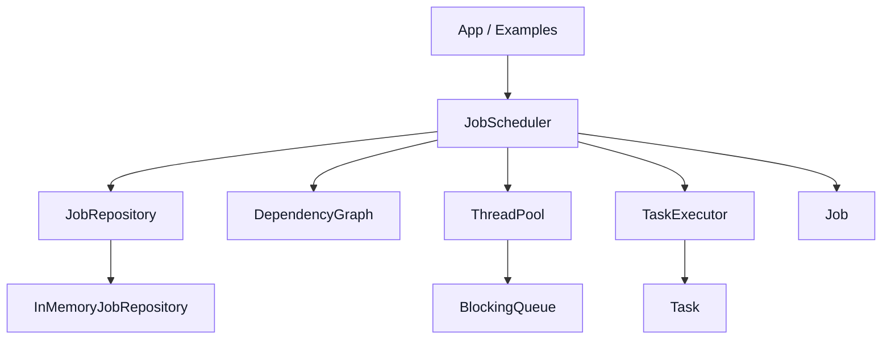

# Distributed Job Scheduler

A C++20 learning-oriented job scheduler that currently runs jobs in a single process with dependency-aware task scheduling, a thread pool, in-memory storage, and test coverage for success and failure cases.

## Overview

The project models a `Job` as a collection of `Task` objects plus dependency relationships between them. A `JobScheduler` uses a dependency graph to find ready tasks, runs them through a local thread pool, updates job/task state, and marks jobs as succeeded, failed, or cancelled.

This repository is not distributed yet. The current implementation is a solid local foundation for a future coordinator/worker design.

## Implemented Features

- C++20 project structure with CMake
- Core `Job`, `Task`, `JobStatus`, and `TaskStatus` models
- Thread-safe in-memory `JobRepository`
- Header-only `BlockingQueue<T>`
- Local `ThreadPool`
- `TaskExecutor` with duration and error capture
- basic retry support using `retryCount` and `maxRetries`
- basic cooperative timeout detection for tasks
- `DependencyGraph` for dependency-aware readiness tracking
- `JobScheduler` for submitting jobs, waiting for completion, querying task/job status, and graceful shutdown
- Failure handling for:
  - task exceptions
  - dependency cycles
  - invalid dependencies
  - duplicate task IDs
  - submit after shutdown
  - unknown job/task status queries
- Example programs for:
  - simple independent tasks
  - dependency execution flow
  - failure handling
- Focused automated test executables for:
  - scheduler flow
  - retry support
  - timeout support
  - failure cases

## Architecture



Layers:

- `core`: domain types such as `Job`, `Task`, `JobStatus`, `TaskStatus`, `JobId`, and `TaskId`.
- `concurrency`: `BlockingQueue<T>` and `ThreadPool`.
- `execution`: `TaskExecutor` and `ExecutionResult`.
- `scheduling`: `DependencyGraph` and `JobScheduler`.
- `storage`: `JobRepository` interface and `InMemoryJobRepository`.

More detail is available in [docs/architecture.md](docs/architecture.md).

## Build

### Windows PowerShell

If PowerShell script execution is restricted:

```powershell
powershell -ExecutionPolicy Bypass -File .\scripts\build.ps1
```

Or run CMake directly:

```powershell
cmake -S . -B build -G "MinGW Makefiles"
cmake --build build
```

### Bash

```bash
./scripts/build.sh
```

## Test

### Windows PowerShell

```powershell
ctest --test-dir build --output-on-failure -V
```

Or:

```powershell
powershell -ExecutionPolicy Bypass -File .\scripts\test.ps1
```

### Bash

```bash
./scripts/test.sh
```

## Examples

After building, you can run:

### Windows PowerShell

```powershell
.\build\example_simple_job.exe
.\build\example_dependent_tasks.exe
.\build\example_failure_handling.exe
```

You can also build a single example target directly:

```powershell
cmake --build build --target example_simple_job
```

### Bash

```bash
./scripts/run_demo.sh
```

## Current Limitations

- The scheduler runs in a single process only
- Storage is in-memory only and not persistent
- There is no network transport, RPC, or cluster coordination
- Jobs are not recoverable after process restart
- Retry support is basic: failed or timed out tasks can be retried up to `maxRetries`, but backoff and richer retry policies are not implemented yet
- Timeout handling is cooperative only: a task is marked timed out after it returns if its runtime exceeded the configured timeout
- Running work is not forcibly interrupted or killed when a timeout is exceeded
- Cancellation is only used during scheduler shutdown; user-driven cancellation is not implemented
- There is no priority scheduling, rate limiting, or backpressure policy
- No external API, CLI, or service interface exists yet

## Future Distributed Design

The long-term direction is a coordinator/worker architecture where:

- a coordinator owns job state and dependency scheduling
- worker nodes register and receive runnable tasks
- workers heartbeat their health back to the coordinator
- failed workers are detected and unfinished tasks are reassigned
- task results are reported back to the coordinator for dependency unlocking and final job completion

See [architecture.md](docs/architecture.md) and [milestone_plan.md](docs/milestone_plan.md) for more detail.
