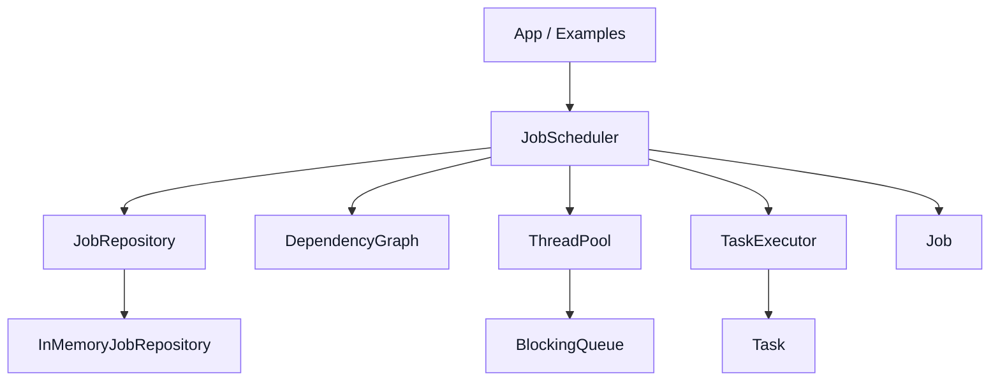

# Architecture

## Overview

The current system is a single-process scheduler composed of five layers:

1. `core`
2. `concurrency`
3. `execution`
4. `scheduling`
5. `storage`

Each layer is intentionally small and focused.

The code does not yet include networked workers, remote task dispatch, persistent storage, or cluster coordination.



## Core Layer

The core layer defines the main domain model:

- `SchedulerTypes.hpp`
  - `JobId`
  - `TaskId`
- `TaskStatus.hpp`
- `JobStatus.hpp`
- `Task.hpp`
- `Job.hpp`

### Responsibilities

- represent jobs and tasks
- store task metadata and callable work
- store job-level dependencies
- track job/task status transitions

### Task Lifecycle State

Tasks currently move through these states:

- `Pending`
- `Ready`
- `Running`
- `Succeeded`
- `Failed`
- `Cancelled`

In practice:

- tasks begin as `Pending`
- dependency resolution moves runnable tasks to `Ready`
- execution moves them to `Running`
- normal completion moves them to `Succeeded`
- exceptions move them to `Failed`
- scheduler shutdown can move unfinished tasks to `Cancelled`

## Concurrency Layer

The concurrency layer contains:

- `BlockingQueue<T>`
- `ThreadPool`

### BlockingQueue

`BlockingQueue<T>` is a header-only thread-safe queue built with:

- `std::queue<T>`
- `std::mutex`
- `std::condition_variable`

It supports blocking `pop`, graceful shutdown, and move-only payloads.

### ThreadPool

`ThreadPool` owns:

- a worker vector
- a shared blocking queue of `std::function<void()>`

Worker threads repeatedly:

1. wait for a task
2. pop it
3. execute it

The thread pool is responsible only for local concurrent execution, not scheduling policy.

## Execution Layer

The execution layer contains:

- `ExecutionResult`
- `TaskExecutor`

### Responsibilities

- measure task execution duration
- call `Task::execute()`
- capture success or failure
- capture exception messages when available

This layer isolates execution bookkeeping from scheduling decisions.

## Scheduling Layer

The scheduling layer contains:

- `DependencyGraph`
- `JobScheduler`

### DependencyGraph

`DependencyGraph` interprets a dependency pair as:

- `(task, dependsOn)`

meaning:

- `task` cannot run until `dependsOn` completes

Internally it keeps:

- adjacency from prerequisite to dependent tasks
- indegree count per task
- completed-task set

### Dependency Scheduling

The current scheduling flow is:

1. a job is submitted
2. the scheduler builds a dependency graph
3. cycle and input validation checks run
4. initial ready tasks are identified
5. ready tasks are submitted to the thread pool
6. when a task succeeds, the graph is updated
7. newly unlocked tasks are submitted
8. when no tasks remain, the job is marked `Succeeded`
9. if any task fails, the job is marked `Failed`

### JobScheduler Responsibilities

- accept submitted jobs
- validate basic job structure
- persist snapshots to the repository
- track per-job runtime state
- use `DependencyGraph` to unlock dependent tasks
- execute work through `ThreadPool` and `TaskExecutor`
- provide blocking wait with `condition_variable`
- handle graceful shutdown and job cancellation on shutdown

`JobScheduler` currently coordinates local execution only. It is not a distributed coordinator yet.

## Storage Layer

The storage layer contains:

- `JobRepository`
- `InMemoryJobRepository`

### Responsibilities

- save job snapshots
- return jobs by ID
- update job state
- answer existence checks

The current implementation is in-memory and protected by a mutex.

The repository stores snapshots of jobs. It is not durable and does not recover jobs after process restart.

## Current End-to-End Flow

```text
submitJob(job)
  -> save initial snapshot
  -> validate dependencies / duplicates / cycles
  -> mark job Running
  -> find initial ready tasks
  -> submit tasks to ThreadPool

worker thread runs task
  -> TaskExecutor calls task.execute()
  -> scheduler updates task status
  -> dependency graph unlocks new tasks
  -> new ready tasks are submitted

job completion
  -> all tasks succeeded => job Succeeded
  -> any task failed => job Failed
  -> scheduler shutdown => unfinished job Cancelled
```
